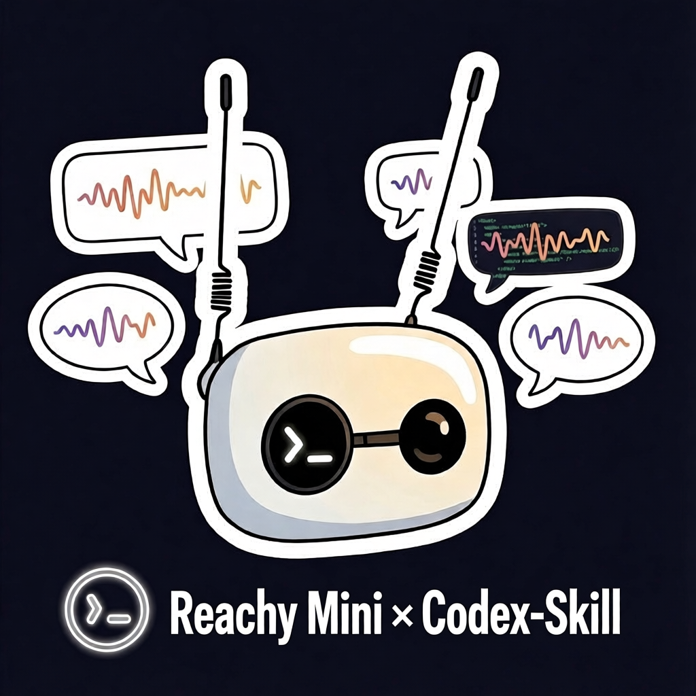

<div align="center">
  <h1>Reachy Mini Apps Skill for Codex</h1>
  
</div>

<p align="center">
  <strong>Codex-installable skill for building, debugging, and publishing Reachy Mini apps with official SDK and daemon workflows.</strong>
</p>

<p align="center">
  <a href="LICENSE"></a>
  <a href="https://developers.openai.com/codex/skills"></a>
  <a href="https://github.com/pollen-robotics/reachy_mini"></a>
</p>

---

## Codex Skill Context

This repository is focused on a single Codex skill at:

- `skills/reachy-mini-apps`

It is structured for installation through Codex skill tooling, not as a full robot app/source monorepo.

Codex skill format and behavior reference:

- https://developers.openai.com/codex/skills

## Install in Codex

Option 1, install with the official installer script:

```bash
python3 ~/.codex/skills/.system/skill-installer/scripts/install-skill-from-github.py \
  --repo jimenezcarrero/reachy-mini-apps-skill \
  --path skills/reachy-mini-apps
```

Option 2, install with your `$skill-installer` wrapper:

```bash
$skill-installer install https://github.com/jimenezcarrero/reachy-mini-apps-skill/tree/main/skills/reachy-mini-apps
```

After installation, restart Codex to load new skills.

## Example Prompts

```text
Use $reachy-mini-apps to scaffold a Reachy Mini app that tracks a target and exposes a small web UI.
```

```text
Use $reachy-mini-apps to debug why my app is jerky when using set_target.
```

```text
Use $reachy-mini-apps to prepare a safe torque enable/disable flow before publishing.
```

## What This Skill Covers

- App creation, checking, and publishing with `reachy-mini-app-assistant`
- Motion architecture (`goto_target` vs `set_target`)
- Safe motor torque handling
- REST and WebSocket endpoint usage
- Quick command/snippet lookup for common tasks
- Camera/audio/IMU handling patterns for app flows
- AI integration patterns for Reachy Mini apps
- Interaction patterns (antennas as buttons, head-as-controller)
- Symbolic motion composition
- Setup and testing checklists
- Debug workflow and source mapping

## Scope Notes

This skill is intentionally app-focused.

Included:

- Practical guidance for building and shipping Reachy Mini applications
- Safety and debugging workflows for real app development

Not duplicated here:

- Full low-level SDK API catalog
- Full hardware sensor deep dive
- OpenAPI codegen playbooks for many languages

For those, use the upstream Reachy Mini SDK/docs and daemon docs listed in Data Sources.

## Skill References

| File | Purpose |
|------|---------|
| `skills/reachy-mini-apps/SKILL.md` | Entry instructions and routing |
| `skills/reachy-mini-apps/references/app-lifecycle.md` | Create/check/publish workflows |
| `skills/reachy-mini-apps/references/motion-control.md` | Motion, control loops, torque safety |
| `skills/reachy-mini-apps/references/api-endpoints.md` | REST/WebSocket endpoint map |
| `skills/reachy-mini-apps/references/api-quick-reference.md` | Fast SDK/REST command lookup |
| `skills/reachy-mini-apps/references/sensors-media.md` | Camera/audio/IMU usage patterns |
| `skills/reachy-mini-apps/references/debug-checklist.md` | Troubleshooting sequence |
| `skills/reachy-mini-apps/references/ai-integration.md` | LLM and tool-calling patterns |
| `skills/reachy-mini-apps/references/interaction-patterns.md` | Physical interaction design |
| `skills/reachy-mini-apps/references/symbolic-motion.md` | Formula-based move design |
| `skills/reachy-mini-apps/references/setup-environment.md` | First-run machine setup |
| `skills/reachy-mini-apps/references/testing-apps.md` | Pre-release validation |
| `skills/reachy-mini-apps/references/source-map.md` | Canonical source file map |

## Repository Layout

```text
.
├── .gitignore
├── LICENSE
├── NOTICE
├── README.md
├── Reachy_mini_Codex_skill.png
└── skills/
    └── reachy-mini-apps/
        ├── SKILL.md
        ├── agents/openai.yaml
        └── references/
            ├── ai-integration.md
            ├── api-endpoints.md
            ├── api-quick-reference.md
            ├── app-lifecycle.md
            ├── debug-checklist.md
            ├── interaction-patterns.md
            ├── motion-control.md
            ├── sensors-media.md
            ├── setup-environment.md
            ├── source-map.md
            ├── symbolic-motion.md
            └── testing-apps.md
```

## Data Sources

This skill was authored from the following public sources:

- Reachy Mini official repository (SDK, daemon, examples):
  https://github.com/pollen-robotics/reachy_mini
- Reachy Mini agent guidance (`agents.md`):
  https://github.com/pollen-robotics/reachy_mini/blob/develop/agents.md
- Reachy Mini in-repo skill references (`skills/*.md`):
  https://github.com/pollen-robotics/reachy_mini/tree/develop/skills
- Reachy Mini official documentation:
  https://huggingface.co/docs/reachy_mini
- OpenAI Codex Skills documentation/spec:
  https://developers.openai.com/codex/skills
- OpenAI skills installer reference repository:
  https://github.com/openai/skills

## License

Licensed under **Apache License 2.0**. See `LICENSE`.

Attribution notices for adapted guidance are listed in `NOTICE`.
